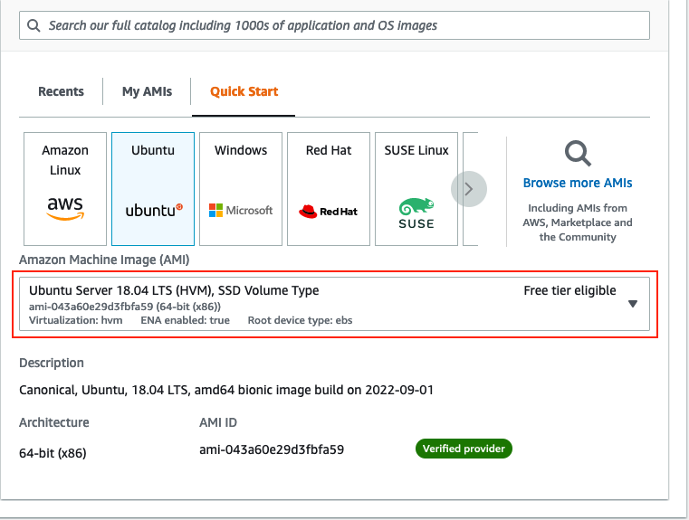
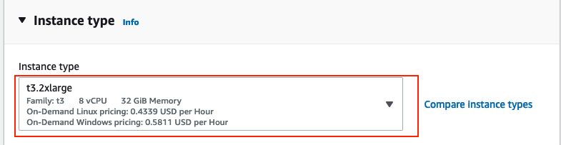
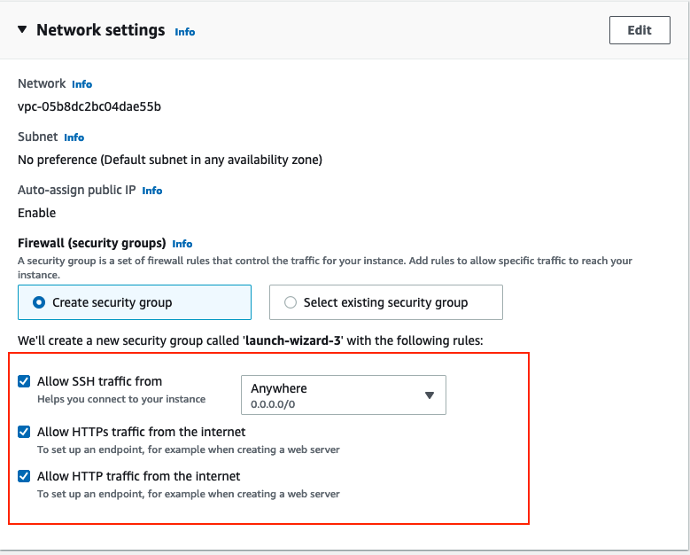

# Creating a JupyterLab Server on a cloud VM

## Requirements
1. An Amazon Web Services Account (AWS)
2. AWS Credits

## Getting Started
1. Log in to the AWS management console https://aws.amazon.com/.
2. Once logged in, search 'EC2' in the search bar and click on the first result.

3. Name your instance and select Ubuntu 18.04 LTS as the VM's OS.

4. Select your instance type based on the number of users that will be utillizing the server.  
   Note: For this conference we used a t3.2xlarge VM but that may be too much for a smaller setup.

5. In the networking section allow HTTP, HTTPS, and SSH traffic from anywhere.

7. Finally, add the following in the User Data section in the Advanced details section. 
```
Content-Type: multipart/mixed; boundary="//"
MIME-Version: 1.0

--//
Content-Type: text/cloud-config; charset="us-ascii"
MIME-Version: 1.0
Content-Transfer-Encoding: 7bit
Content-Disposition: attachment; filename="cloud-config.txt"

#cloud-config
cloud_final_modules:
- [scripts-user, always]

--//
Content-Type: text/x-shellscript; charset="us-ascii"
MIME-Version: 1.0
Content-Transfer-Encoding: 7bit
Content-Disposition: attachment; filename="userdata.txt"

#!/bin/bash
curl -L https://tljh.jupyter.org/bootstrap.py \
  | sudo python3 - \
    --admin [admin-username]
```
9. Create your instance
10. It will take anywhere from 5-10 minutes for JupyterHub to bootstrap.
11. When is is done, naviagte to your VM's publicly facing IP address and login with the username you provided above
    Note: The first password you enter will be the password for that user.
12. Once logged in, we can optionally set a configuration to ensure that a user's server does not automatically shut down.
```
sudo tljh-config set services.cull.enabled False
sudo tljh-config reload
```
    
### Optional: Registering a domain name and enabling HTTPS
1. Login to your AWS Console
2. Search Route 53
3. Search for an available domain name and purchase it
4. Navigate to the hosted zones tab in route 53
5. Create a new record with the subdomain as the key and the public facing IP address of your EC2 instance as the value.
6. Run the following commands as administrator in an admin terminal on your JupyterHub instance
```
sudo tljh-config set https.enabled true
sudo tljh-config set https.letsencrypt.email you@example.com
sudo tljh-config add-item https.letsencrypt.domains previously.registered.domain.name
sudo tljh-config reload proxy
```
7. Your JupyterHub server should now be secured over HTTPS

### Optional: Using JupyterLab as opposed to JupyterHub
1. Login to JupyterHub and open an administrator terminal
2. Run the following commands
```
sudo tljh-config set user_environment.default_app jupyterlab
sudo tljh-config reload hub
```
