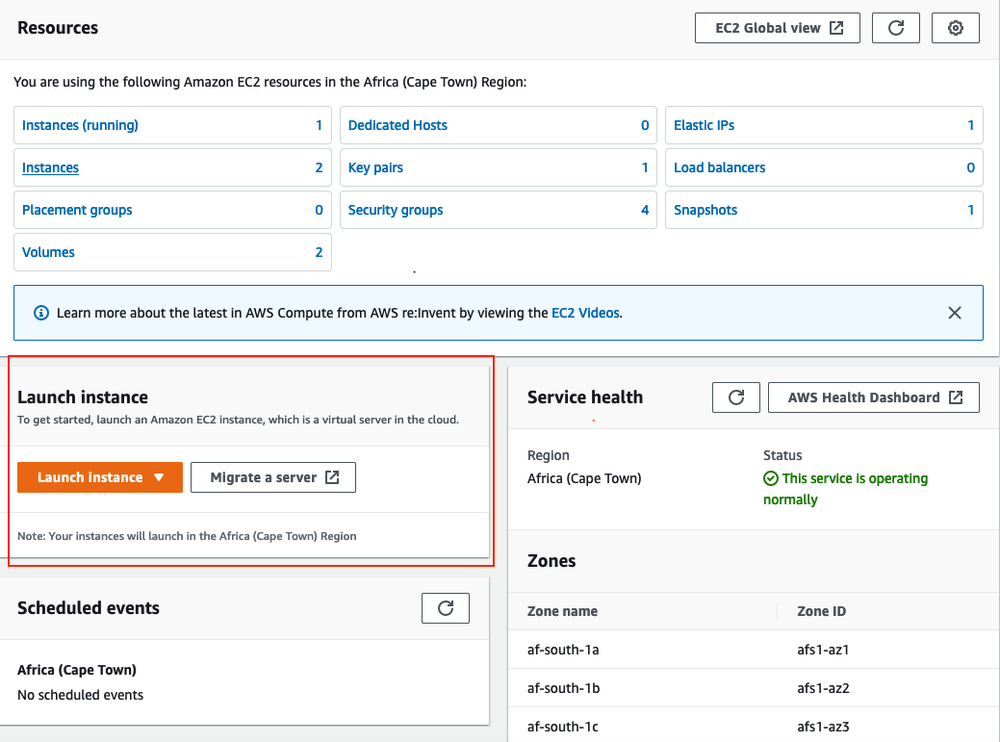

# Creating a JupyterLab Server on a cloud VM

## Requirements
1. An Amazon Web Services Account (AWS)
2. AWS Credits

## Getting Started
1. Log in to the AWS management console https://aws.amazon.com/.
2. Once logged in, search 'EC2' in the search bar and click on the first result.

3. Name your instance and select Ubuntu 18.04 LTS as the VM's OS.
4. Select your instance type based on the number of users that will be utillizing the server.  
   Note: For this conference we used a t3.2xlarge VM but that may be too much for a smaller setup.
5. In the networking section allow HTTP, HTTPS, and SSH traffic from anywhere.
6. Finally, add the following in the User Data section in the Advanced details section
7. Create your instance
